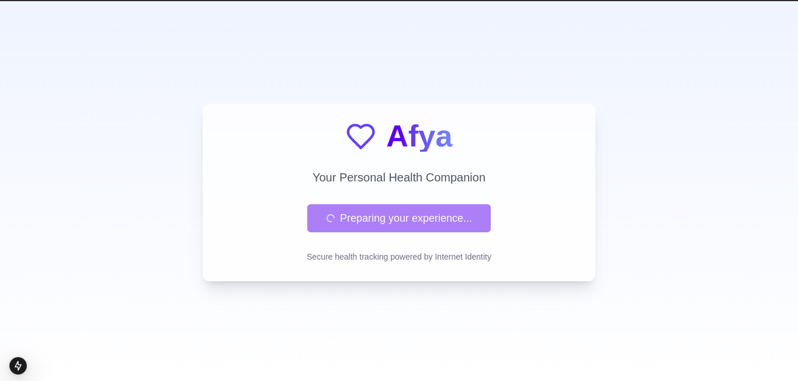
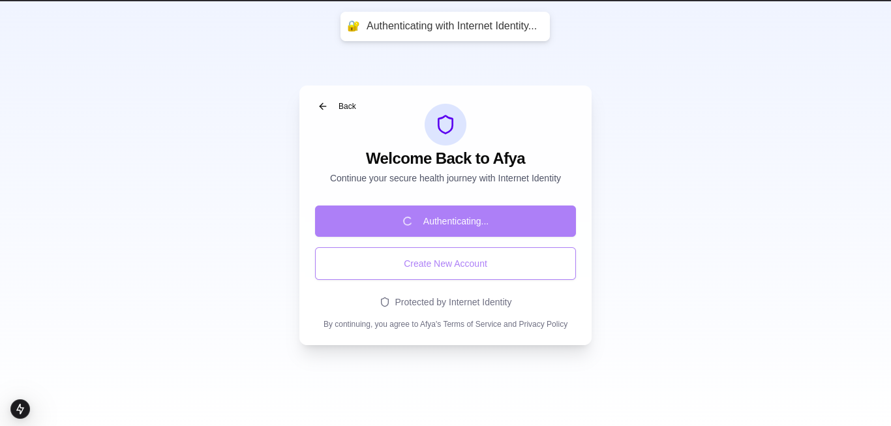
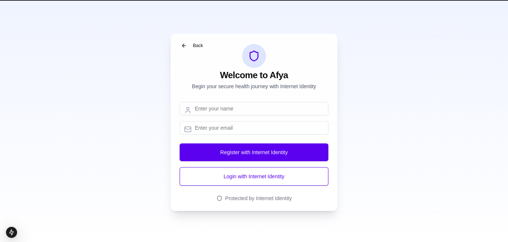
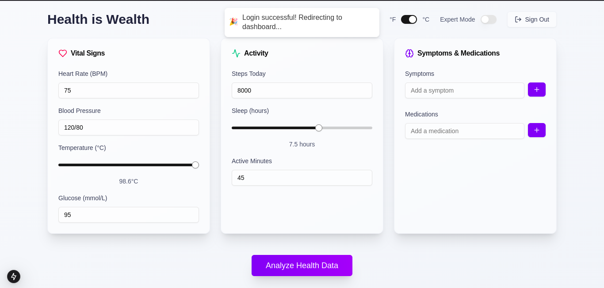
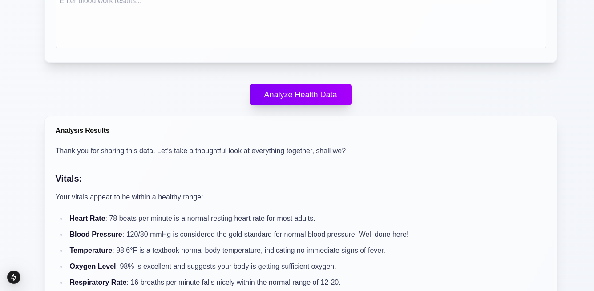

# 🏥 AI Health Companion

A decentralized personal health monitoring and analysis platform built on the Internet Computer Protocol (ICP). This application combines the power of AI with secure, decentralized storage to provide personalized health insights and tracking.

## 🌟 Features

- 🔐 Secure user authentication and management
- 📊 Comprehensive health data tracking including:
  - Vital signs monitoring (heart rate, blood pressure, temperature, etc.)
  - Activity metrics (steps, sleep, active minutes)
  - Professional medical data (ECG, blood work, imaging)
- 🤖 AI-powered health predictions and analysis
- 📱 Responsive web interface built with Next.js
- 🔒 Decentralized storage on Internet Computer

## 🏗️ Technology Stack

- **Backend**: Internet Computer (ICP) with Azle framework (TypeScript)
- **Frontend**: Next.js
- **Storage**: Internet Computer's StableBTreeMap
- **Authentication**: Internet Computer Identity

## 🚀 Getting Started

### Prerequisites

- Node.js (v16 or higher)
- DFX CLI (latest version)
- Internet Computer Wallet
- Git

### Installation

1. Clone the repository:
```bash
git clone https://github.com/tufstraka/ai-health-companion
cd ai-health-companion
```

2. Install dependencies and run frontend locally:
```bash
cd afya_frontend
npm install
npm run dev
```

3. Install dependencies and deploy the canister locally:
```bash
cd ..
cd afya_backend
npm install
dfx start --background
dfx deploy
```
Make sure you're environment variables look like this.  

```bash
NEXT_PUBLIC_AZURE_ENDPOINT=https://ai-keithkadima3970ai074778735402.openai.azure.com/openai/deployments/gpt-4o/chat/completions?api-version=2024-08-01-preview
NEXT_PUBLIC_AZURE_MODEL_VERSION=2024-08-01-preview
NEXT_PUBLIC_AZURE_DEPLOYMENT_ID=gpt-4o
NEXT_PUBLIC_NODE_ENV=development
NEXT_PUBLIC_II_CANISTER_ID=aovwi-4maaa-aaaaa-qaagq-cai
NEXT_PUBLIC_CANISTER_ID=a4tbr-q4aaa-aaaaa-qaafq-cai
NEXT_PUBLIC_AZURE_API_KEY=EmJXpfa4gdMf7a4D7Mb5WhPNCJhwqHAWJPH1Rb9ltBzmqLMq56GtJQQJ99ALACYeBjFXJ3w3AAAAACOG1Yfo
```

## Screenshots

### Home
 

### Login 


### Registration


### Dashboard




## 🔄 API Routes

### User Management

- `registerUser`: Create a new user account
- `loginUser`: Authenticate user
- `getUserById`: Retrieve user information
- `updateUser`: Update user profile
- `deleteUser`: Remove user account

### Health Data Management

- `saveHealthData`: Store new health records
- `getHealthDataById`: Retrieve specific health record
- `getAllHealthData`: Get all health records for authenticated user
- `saveAIAnalysis`: Store AI-generated health predictions

### System Statistics

- `getSystemStats`: Retrieve system-wide statistics
- `getAllUsers`: Get list of all users (admin only)
- `getAllPredictions`: Get all AI predictions (admin only)


## 🛡️ Security Features

- Decentralized data storage
- User authentication via Internet Computer Identity
- Data encryption at rest
- Access control for personal health records
- Secure API endpoints

## 🤝 Contributing

Contributions are welcome! 

## 📝 License

This project is licensed under the MIT License - see the LICENSE file for details.

## 🙏 Acknowledgments

- Internet Computer Protocol team
- Azle framework developers
- Next.js community
- All contributors and supporters

## ⚠️ Disclaimer

This application is not a substitute for professional medical advice, diagnosis, or treatment. Always seek the advice of your physician or other qualified health provider with any questions you may have regarding a medical condition.
